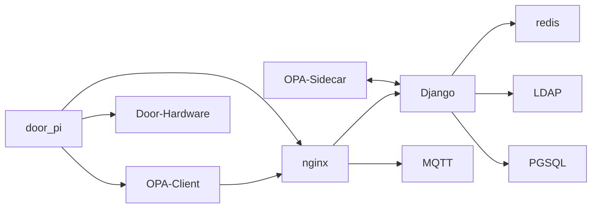
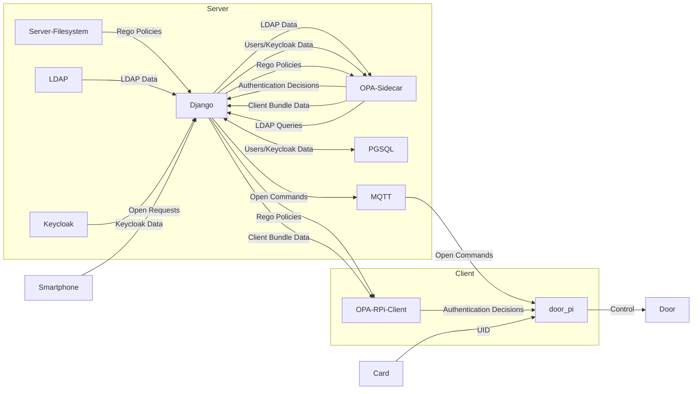

# Readme

The client to this server is available at https://github.com/zam-haus/door_pi

0. Set your compose environment in .env (`docker compose` on Ubuntu, `docker-compose` on Debian, `podman-compose` if using Podman)
1. Add the hostname 
   1. in .env to ALLOWED_HOSTS
   2. in nginx.conf to server_name
2. ./set-secrets.sh
3. ./create-superuser.sh
4. ./launch-containers.sh
5. Login to http://127.0.0.1:80
6. Open the admin interface
7. Create a door
8. Start ./mqtt_dump_all_messages.sh in a separate terminal
9. Open the application home page
10. Click the button
11. Watch the listener receiving the mqtt message
12. You can update a door's status with the following command (fill in your door's mqtt id)

    ```(. secrets.env ; mosquitto_pub -h localhost -u controller -P "${MQTT_PASSWD_CONTROLLER}" -p 1883 -d -t 'door/f16f33d2-7d87-45d3-937d-f5d64d957e8f/presence' -m 'true')```

# Development with pycharm
You need to set some environment variables in the run configuration:

```
PYTHONUNBUFFERED=1;DJANGO_SETTINGS_MODULE=door_commander.settings;ACTIVATE_DEBUG_MODE=active;OPA_URL=http://localhost:8181/
```

See also the .env loaded by pipenv run and debug.sh

# OPA debugging
You can access the data in the debug-mode-containers started with debug.sh via 

http://127.0.0.1:8181/v1/data/app/door_commander/physical_access

or you can go to http://127.0.0.1:8181/ and use the query

```
result := data.app.door_commander.physical_access
```

Authentication for the OPA server is disabled in debug containers

The bundle server is available at http://127.0.0.1:8000/opa-bundles/bundles/sidecar_authz.tar.gz when running debug.sh.

The RPi OPA Instance started with ./debug-opa-client.sh while running ./debug.sh can be accessed via http://127.0.0.1:8182/v1/data .

# Client Server Architecture



# Data Flows

## Overview



## Smartphone Authentication Flow

- Django reads policies and provides them to OPA sidecar
- User authenticates
- Keycloak provides user UUID and permission claims
- Django saves user UUID and permission claim data to DB
- User requests a door to open
- Django takes door MQTT id, user UUID and permission claim data of the logged in user and sends it to OPA sidecar
- OPA sidecar matches the permission claims against the door IDs with an internal mapping from the "app.door_commander.physical_access" policy
- OPA sidecar returns allowed flag


## Card Authentication Flow

- Django reads policies and provides them to OPA sidecar and to OPA client
- User authenticates
- Keycloak provides user UUID and permission claims
- Django saves user UUID and permission claim data to DB
- Django provides user UUID and permissions to OPA sidecar as bundled "django" data
- Django receives LDAP queries from OPA sidecar
- Django executes LDAP queries and provides response data to OPA sidecar as bundled "ldap" data
- OPA sidecar prepares OPA client data in the "app.door_commander.door_authz" policy
- Django receives OPA client data and provides it and polcies to OPA client as a bundle
- User presents card
- Cardreader sends card data to door_pi client software
- door_pi client software sends card data and door id to OPA client
- OPA client matches the card data against the user id, the user's ldap groups and the permiited door IDs with an internal mapping from the policy
- OPA client returns allowed flag
